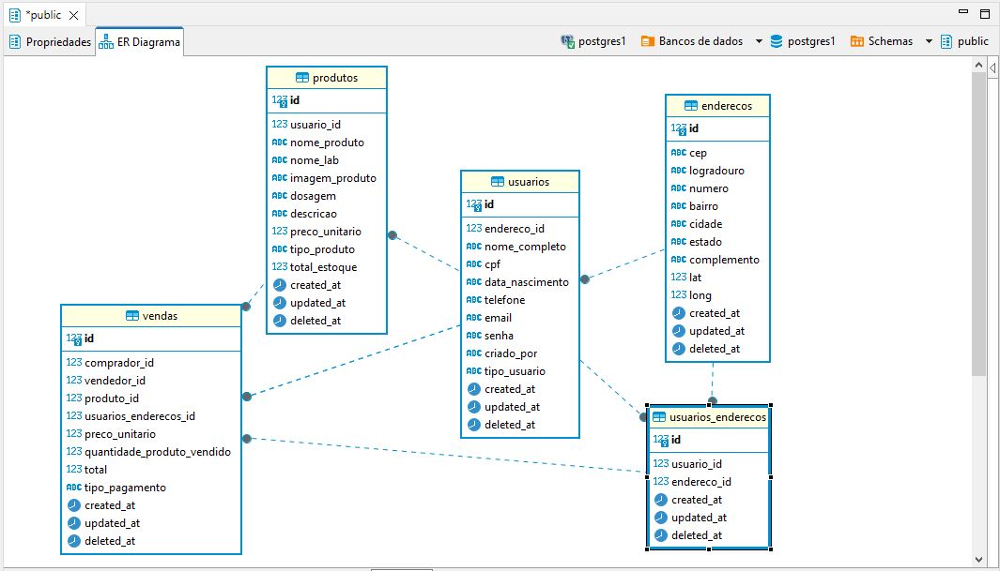
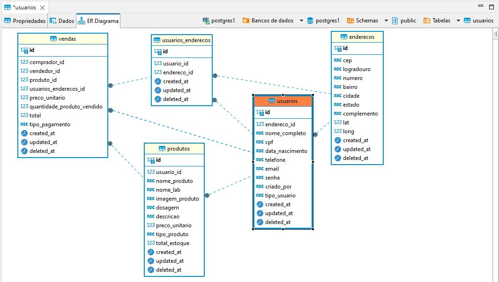
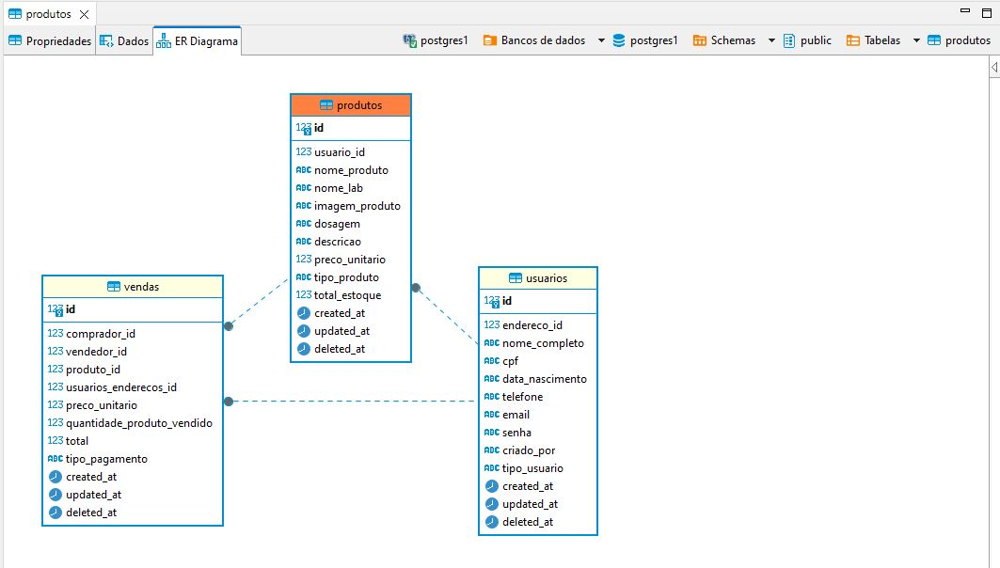

# M3P-BackEnd-Squad2
# LAB365-FullStack-M03-ProjetoFinal-Marketplace de Medicamentos
## Projeto Avaliativo do Módulo3
## LAB365- FullStack - Itaguaçu
### Projeto realizado em squad, formado pelos alunos desenvolvedores:
- Carlos Hnerique Moreira Junior (Github - https://www.github.com/chmjr)
- Debora Patricia Santos de Souza (Github - https://www.github.com/deborasous )
- Rafael Zampieron (Github - https://www.github.com/rafazamp )
- Ricardo Werner Grosscklauss (Github - https://www.github.com/ricado-werner)

#### Criação de sistema de Marketplace (E-Commerce):
- Frontend - React.JS
- Backend - Node.JS, Express, Sequelize em banco de dados PostgreSQL
  
#### Nome do sistema: PharmaSellticos

<p align="center">
  
</p>

### 🔗 Links
*** links das redes sociais de cada participante


Status - Finalizado

### Demonstração

Estrutura geral do back-end das Tabelas
<p align="center">
  
</p>

Estrutura geral do back-end dos Usuários
<p align="center">
  
</p>

Estrutura geral do back-end dos Medicamentos
<p align="center">
  
</p>
Estrutura geral do back-end de Vendas
<p align="center">
  
</p>

### O Desafio
Neste projeto, desenvolvemos um sistema completo de Marketplace para produtos farmacêuticos, gerenciando múltiplos vendedores, clientes e vendas de forma online, utilizando React.JS e Node.JS.

### Formato do Sistema

### Back-end

### Requisitos da Aplicação

| Item | Descrição                                                                    |
| ---- | ---------------------------------------------------------------------------- |
| 1    | Ser uma API Rest desenvolvida em Node.JS com uso do Express.js.              |
| 2    | Utilizar o banco de dados PostgreSQL.                                        |
| 3    | Ser planejado utilizando o modelo Kanban na ferramenta Trello.               |
| 4    | Ser versionado no GitHub, possuindo uma documentação detalhada no readme.md. |
| 5    | Deverá ser criado um pith de apresentação de 15 minutos.                     |

### Formato do Sistema

| Item                                | Descrição                                                                                                                |
| ------------------------------------| ------------------------------------------------------------------------------------------------------------------------ |
| Carregamento de Dados Iniciais      | Deve ser utilizado como Sistema Gerenciador de BD o PostgreSQL.                                                          |
| Cadastro de Usuário                 | Serviço de cadastro de Administrador e Comprador com dados completos, definição de Endpoint.                             |
| Login do Usuário                    | Serviço para realizar o login como Administrador ou Comprador, definição de Endpoint.                                    |
| Cadastro de Medicamentos            | Serviço de cadastro de medicamentos pelo Administrador, com dados completos, definição de Endpoint.                      |
| Listagem de Medicamentos            | Serviço de listagem de medicamentos cadastrados pelo Administrador, definição de Endpoint.                               |
| Listagem de Medicamentos            | Serviço de listagem de todos os medicamentos cadastrados no sistema, definição de Endpoint.                              |
| Listagem de Medicamentos/ID         | Serviço de listagem de medicamentos pelo seu ID, definição de Endpoint.                                                  |
| Listagem de endereços Comprador     | Serviço de listagem de todos os endereços cadastrados do Comprador, definição de Endpoint.                               |
| Editar Medicamentos                 | Serviço de edição de medicamentos cadastrados, definição de Endpoint.                                                    |
| Listagem de Usuarios                | Serviço de listagem de todos os usuários cadastrados no sistema, definição de Endpoint.                                  |
| Listagem de Usuario/ID              | Serviço de listagem de usuário pelo seu ID, definição de Endpoint.                                                       |
| Editar Usuario                      | Serviço de edição de usuário cadastrado no sistema, definição de Endpoint.                                               |
| Criar Vendas                        | Serviço de criação de venda de medicamentos cadastrados no sistema, definição de Endpoint.                               |
| Listagem de Compras                 | Serviço de listagem de todas as vendas do Comprador logado, definição de Endpoint.                                       |
| Listagem de Vendas                  | Serviço de listagem de todas as vendas do Administrador logado, definição de Endpoint .                                  |
| Dashboard                           | Serviço de listagem de todos os resultados financeiros das vendas realizadas, definição de Endpoint.                     |
| Documentação SWAGGER                | Serviço de implementação de documentação interativa e amigável para API’s .                                              |
| Deploy                              | Serviço de implementação de uma aplicação em ambiente de produção, de forma confiável, segura e eficiente para uso real. |

### Link de acesso:
- Swagger
- 

- Deploy
- https://projeto03.onrender.com/

### Plano do Projeto

No desenvolvimento desta aplicação, colocamos em prática:

| Item | Descrição  |
| ---- | ---------- |
| 1    | Node.JS    |
| 2    | Express.JS |
| 3    | Sequelize  |
| 4    | PostgreSQL |
| 5    | Swagger    |
| 6    | Deploy     |
| 7    | Skills     |
| 8    | Squad      |

### Tecnologias utilizadas:

- Visual Studio Code
- NodeJS (compilação Vite - página oficial - https://vitejs.dev/ )
- Trello


## Para utilizar este projeto como base, faça o seguinte passo-a-passo:

### Nota - Para que o sistema funcione corretamente, primeiramente é necessário ter instalado no seu computador:
- Node.JS
- Node Package Manager(NPM)
- PostgreSQL (Base de dados)
- Aplicativo de gerenciador de banco de dados

Clone o projeto para a sua máquina
```bash
gh repo clone FullStack-Itaguacu/M3P-BackEnd-Squad2
```

Instale as dependências.

```bash
npm install
```

- Rode o projeto

```bash
npm run start:dev
```


## Autores:
```bash
Turma: Full-Stack - Itaguaçu
Squad: ItaguaDevs
Mentoria: Prof. Pedro Henrique Silva
Senai/SC: Serviço Nacional de Aprendizagem Industrial
LAB365: espaço do @senai.sc para desenvolver as habilidades do futuro
Floripa Mais Tech - Iniciativa da Prefeitura de Florianópolis - SC
```
